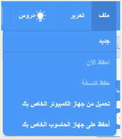

أولا، لإعطاء برنامجك اسما، اكتب اسم برنامجك في مربع اسم المشروع في الجزء العلوي من الشاشة:

ثم لحفظ مشروعك ، انقر فوق **ملف**، ثم على **حفظ الآن**:

**ملاحظة:** إذا كنت غير متصل أو ليس لديك حساب Scratch يمكنك النقر على **حفظ إلى جهاز الكمبيوتر الخاص بك** لحفظ نسخة من مشروعك.
