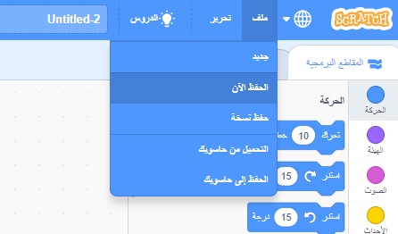

+ Give your program a name by typing into the text box at the top.

+ يمكنك الضغط على **ملف** ثم **حفظ الأن** لحفظ مشروعك.

**ملاحظة:** إذا كنت تستخدم برنامج Scratch عن طريق الانترنت ولا تملك حسابا فيه، يمكنك حفظ نسخة من مشروعك عن طريق النقر على **تنزيل الى جهازك**.