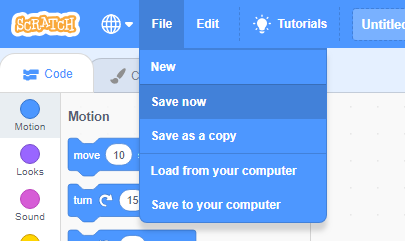

First, to give your program a name, type the name of your program in the project name box at the top of the screen:

**দ্রষ্টব্য:** আপনি যদি স্ক্র্যাচ অনলাইন ভার্শন ব্যাবহার করে থাকেন এবং স্ক্র্যাচে অ্যাকাউন্ট না থাকে তাহলে আপনি **আপনার কম্পিউটার এ সেভ করুন** -এ ক্লিক করে আপনার প্রজেক্টটি সেভ করতে পারেন।.

**Note:** If you are not online or you do not have a Scratch account, you can click on **Save to your computer** to save a copy of your project.