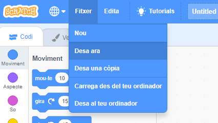

+ Posa un nom al teu programa escrivint en el quadre de text de la part superior.

+ Fes clic a **Fitxer** i **Desa ara** per guardar el projecte.

**Nota:** si no estàs en línia o no tens un compte de Scratch, pots desar una còpia del projecte fent clic a **Desa al teu ordinador**.