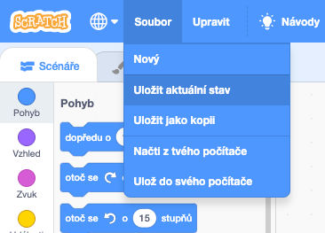

First, to give your program a name, type the name of your program in the project name box at the top of the screen:

**Poznámka:** pokud nejsi online nebo nemáš účet Scratch, můžeš uložit kopii svého projektu kliknutím na tlačítko **Ulož do svého počítače**.

**Note:** If you are not online or you do not have a Scratch account, you can click on **Save to your computer** to save a copy of your project.