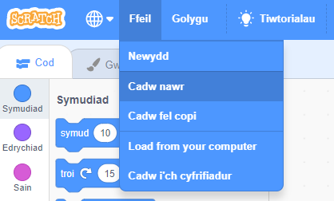

+ Rho enw i dy brosiect gan deipio un i’r blwch testun ar y top.

+ Gelli di glicio **Ffeil** ac yna **Cadw nawr** i gadw dy brosiect.

**Nodyn:** Os nad wyt ti arlein neu os nad oes gen ti gyfrif Scratch, mae modd arbed dy brosiect trwy glicio **Llwytho i’r cyfrifiadur** yn lle.