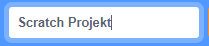

+ Give your program a name by typing into the text box at the top.

+ Du kan klikke på **Fil** og derefter **Gem nu** for at gemme dit projekt.

**Bemærk:** Hvis du bruger Scratch online, men ikke har en Scratch-konto, kan du gemme en kopi af dit projekt ved at klikke på **Download til din computer** i stedet for.