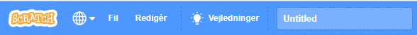
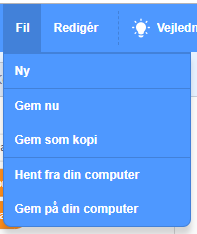

+ Giv dit program et navn ved at skrive det ind i tekstboksen øverst.

+ Du kan klikke på **Fil** og derefter **Gem nu** for at gemme dit projekt.

**Bemærk:** Hvis du ikke er online eller ikke har en Scratch-konto, kan du gemme en kopi af dit projekt ved at klikke på **Gem på din computer** i stedet.
