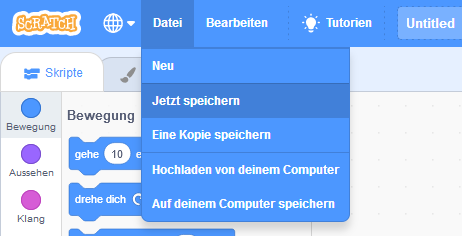

+ Gebe deinem Projekt einen Namen, indem du ihn in das Textfeld oben eingibst.

+ Um dein Projekt zu speichern, klickst du auf **Datei** und dann auf **Jetzt speichern**.

**Note:** if you are not online or don't have a Scratch account, you can save a copy of your project by clicking on **Save to your computer** instead.