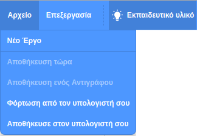

Αρχικά, για να δώσεις ένα όνομα στο πρόγραμμά σου, πληκτρολόγησε το όνομα του προγράμματός σου στο πλαίσιο ονόματος έργου στο επάνω μέρος της οθόνης:

Στη συνέχεια, για να αποθηκεύσεις το έργο σου, κάνε κλικ στο **Αρχείο** και, στη συνέχεια, στο **Αποθήκευση τώρα**:

**Σημείωση:** Εάν δεν είσαι συνδεδεμένος/η ή δεν έχεις λογαριασμό Scratch, μπορείς να κάνεις κλικ στο **Αποθήκευση στον υπολογιστή σου** για να αποθηκεύσεις ένα αντίγραφο του έργου σου.
