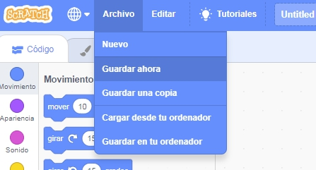

+ Dale un nombre a tu programa escribiéndolo en el cuadro de texto en la esquina superior.

+ Para guardar tu proyecto, puedes hacer clic en **Archivo** y luego en **Guardar ahora**.

**Note:** if you are not online or don't have a Scratch account, you can save a copy of your project by clicking on **Save to your computer** instead.