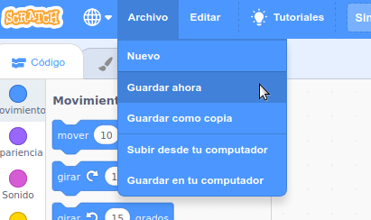

Primero, para darle un nombre a tu programa, escribe el nombre que prefieras en el cuadro de texto en la parte superior de la pantalla:

Then, to save your project, click on **File**, and then on **Save now**:

**Note:** If you are not online or you do not have a Scratch account, you can click on **Save to your computer** to save a copy of your project.