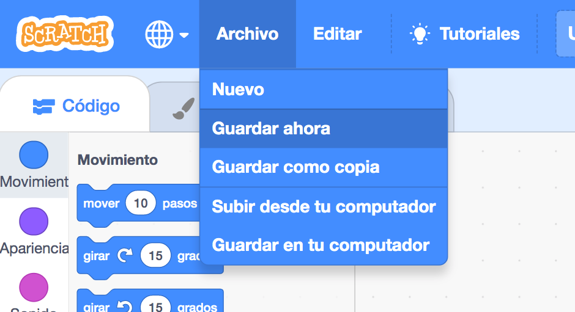

+ Dale un nombre a tu programa escribiéndolo en el cuadro de texto en la esquina superior.

+ Puedes hacer clic en **Archivo** y después en **Grabar ahora** para guardar tu proyecto.

**Nota:**Si no tienes conexión a Internet o no tienes cuenta de Scratch, puedes guardar una copia de tu proyecto haciendo clic en **Guardar en tu computadora**.