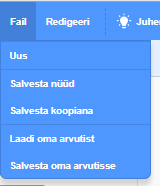

+ Anna oma programmile nimi, trükkides see ülaosas olevasse tekstikasti.

+ Võid klõpsata **Fail** ja seejärel **Salvesta nüüd** oma projekti salvestamiseks.

**Märkus:**kui sa pole võrgu kaudu kättesaadav või ei oma Scratchi kontot, saad salvestada oma projekti koopia klõpsates hoopis **Salvesta oma arvutisse**.