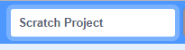

+ Give your program a name by typing into the text box at the top.

+ شما می توانید برای ذخیره‌سازی پروژه‌ی خود، روی **فایل** و سپس **الان ذخیره کن** کلیک کنید.

**توجه:** اگر شما از نسخه‌ی آنلاین اسکرچ استفاده می‌کنید، ولی حساب کاربری اسکرچ ندارید، می‌توانید یک کپی از پروژه خود را با کلیک روی **روی کامپیوتر خودت دانلود کن**بر روی رایانه‌ی خود ذخیره کنید.