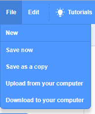

+ با نوشتن در جعبه‌ی متن واقع در بالا، به برنامه‌ی خود یک نام اختصاص دهید.

+ شما می توانید برای ذخیره‌سازی پروژه‌ی خود، روی **فایل** و سپس **الان ذخیره کن** کلیک کنید.

**Note:** if you are not online or don't have a Scratch account, you can save a copy of your project by clicking on **Save to your computer** instead.