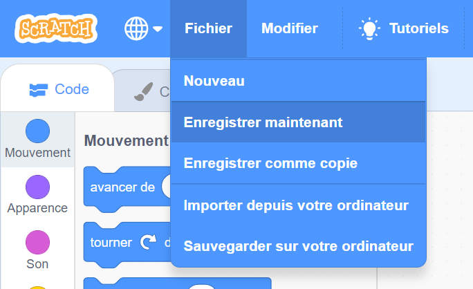

Tout d'abord, pour donner un nom à ton programme, tape le nom de ton programme dans la zone nom du projet en haut de l'écran :

Ensuite, pour enregistrer ton projet, clique sur **Fichier**, et sur **Enregistrer maintenant** :

**Remarque :** si tu n'es pas en ligne ou que tu n'as pas de compte Scratch, tu peux cliquer sur **Sauvegarder sur votre ordinateur** pour enregistrer une copie de ton projet.
