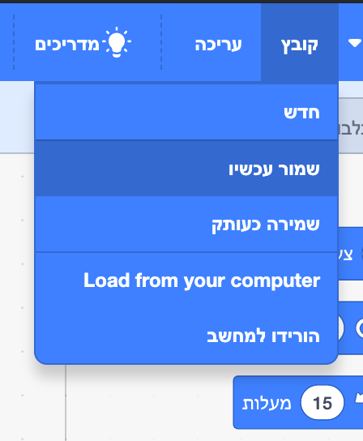

First, to give your program a name, type the name of your program in the project name box at the top of the screen:

**הערה:** אם אינכם מחוברים לאינטרנט או שאין לכם חשבון סקראץ׳, אתם יכולים לשמור עותק של הפרויקט שלכם על ידי לחיצה על **שמור למחשב שלך** במקום זאת.

**Note:** If you are not online or you do not have a Scratch account, you can click on **Save to your computer** to save a copy of your project.