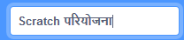

+ Give your program a name by typing into the text box at the top.

+ आप अपने प्रोजेक्ट को सहेजने के लिए **File** और फिर **Save now** पर क्लिक कर सकते हैं।

**ध्यान दें:** यदि आप Scratch ऑनलाइन उपयोग कर रहे हैं, परन्तु आपके पास Scratch खाता नहीं है, तो आप **Download to your computer** पर क्लिक करके अपने प्रोजेक्ट की प्रतिलिपि को सहेज सकते हैं।