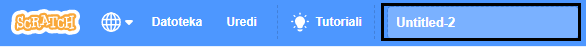
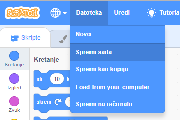

Da bi svom programu dao/la naziv, upiši naziv svog programa u okvir za naziv projekta na vrhu ekrana:

Zatim, da bi spremio/la svoj projekt, klikni na **Datoteka** i zatim na **Spremi sada**:

**Napomena:** ako koristiš Scratch bez internetske veze ili nemaš korisnički račun, možeš spremiti kopiju svog projekta klikom na **Spremi na računalo**.