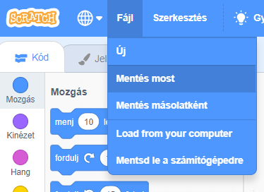

+ Give your program a name by typing into the text box at the top.

+ A projekt mentéséhez kattints a **Fájl** menüre, majd a **Mentés** menüpontra.

**Megjegyzés:** ha online módban használod a Scratchet, de nincs Scratch fiókod, letöltheted a projektedet a **Letöltés saját gépre** menüponttal.