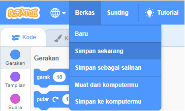

+ Give your program a name by typing into the text box at the top.

+ Kamu bisa klik **Berkas** dan kemudian **Simpan Sekarang** untuk menyimpan proyek Kamu.

**Catatan:** jika Kamu menggunakan Scratch secara daring namun tidak memiliki akun Scratch, Kamu dapat menyimpan salinan proyek Kamu dengan mengklik **Unduh ke komputermu**.