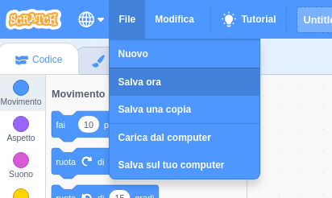

Per prima cosa, per dare un nome al tuo programma, digita il nome del tuo programma nella casella del nome del progetto nella parte superiore dello schermo:

Poi, per salvare il tuo progetto, clicca su **File**, e poi su **Salva ora**:

**Nota:** se non sei online o non hai un account Scratch, puoi comunque salvare una copia del tuo progetto selezionando **Salva sul tuo computer**.