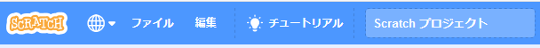

+ Give your program a name by typing into the text box at the top.

+ **ファイル** をクリックし、 **直ちに保存（ほぞん）** をクリックしてプロジェクトを保存することができます。

**注：** Scratchのオンライン版をアカウント無しで使用している場合、 **手元のコンピュータにダウンロード** をクリックしてプロジェクトのコピーを保存できます。