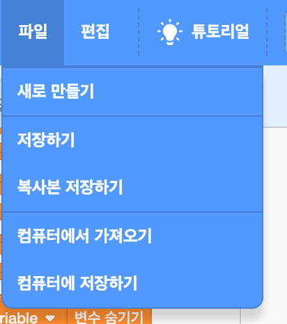

+ Give your program a name by typing into the text box at the top.

+ **파일** 을 클릭 한 다음 **지금 저장**을 클릭하여 프로젝트를 저장할 수 있습니다.

**참고 :** 온라인에서 스크래치를 사용하고 있지만 스크래치 계정이없는 경우 **컴퓨터에 다운로드** 을 클릭하여 프로젝트 사본을 저장할 수 있습니다.