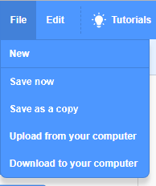

+ Give your program a name by typing into the text box at the top.

+ You can click **File** and then **Save now** to save your project.

**Note:** if you're using Scratch online but don't have a Scratch account, you can save a copy of your project by clicking **Download to your computer** instead.