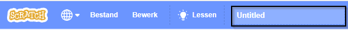
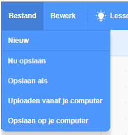

Om je programma een naam te geven, typ je eerst de naam van jouw programma in het vak met de projectnaam bovenaan het scherm:

Klik vervolgens voor het opslaan van je project, op **Bestand**, en vervolgens op **Nu opslaan**:

**Opmerking:** Als je niet online bent of je hebt geen Scratch-account klik op **Opslaan op je computer** om een kopie van je project op te slaan.
