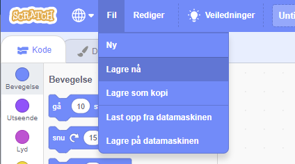

First, to give your program a name, type the name of your program in the project name box at the top of the screen:

**Merk:** Hvis du ikke er online eller ikke har en Scratch-konto, kan du lagre en kopi av prosjektet ved å klikke på **Lagre på datamaskinen** i stedet.

**Note:** If you are not online or you do not have a Scratch account, you can click on **Save to your computer** to save a copy of your project.