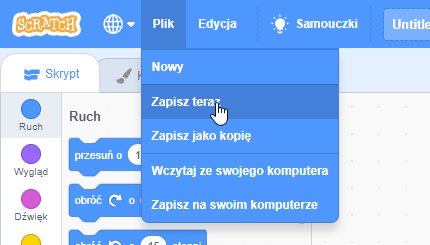

Najpierw, aby nadać swojemu programowi nazwę, wpisz jego nazwę w polu nazwy projektu u góry ekranu:

Następnie, aby zapisać projekt, kliknij **Plik**, a następnie **Zapisz teraz**:

**Uwaga:** Jeśli nie jesteś online lub nie masz konta Scratch, możesz kliknąć **Zapisz na swoim komputerze** aby zapisać kopię swojego projektu.

