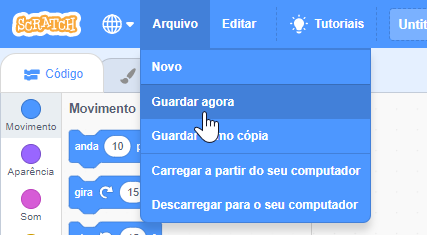

Dá um nome ao teu programa escrevendo-o no caixa de texto no topo.

**Nota:** Se não estiveres a usar o Scratch online, ou não tens uma conta no Scratch, podes guardar uma cópia do teu projeto clicando em **Guardar no teu computador**.

Podes clicar em **Arquivo** e depois em **Guardar** para guardares o teu projeto.