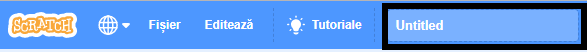
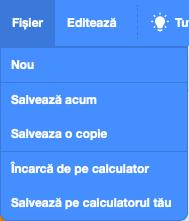

+ Dă un nume programului tău prin introducerea denumirii în caseta text de sus.

+ Poți da click pe **Fișier**, iar apoi pe **Salvează acum** pentru a-ți salva proiectul.

**Notă:** dacă nu ești online sau nu ai un cont Scratch, poți să salvezi o copie a proiectului tău dând click în schimb pe **Salvează pe calculatorul tău**.