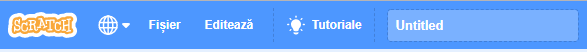

+ Give your program a name by typing into the text box at the top.

+ Puteți face clic pe **Fișier**, iar apoi pe **Salvează acum** pentru a salva proiectul.

**Notă:** dacă utilizați Scratch online, dar nu aveți un cont Scratch, puteți doar să salvați o copie a proiectului făcând clic pe **Descarcă pe calculatorul tău**.