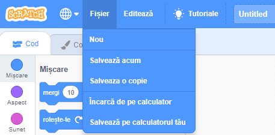

+ Dă un nume programului tău prin introducerea denumirii în căsuța text de sus.

+ You can click **File** and then **Save now** to save your project.

**Note:** if you are not online or don't have a Scratch account, you can save a copy of your project by clicking on **Save to your computer** instead.