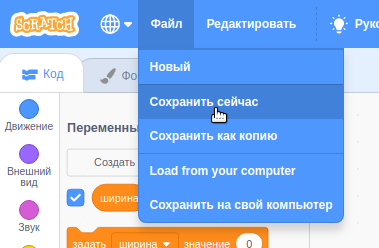

Сначала, чтобы назвать свою программу, напиши имя своей программы в текстовом поле вверху экрана:

Затем, чтобы сохранить проект, нажмите **Файл**, а затем **Сохранить сейчас**:

**Примечание:** Если вы не в сети или у вас нет учетной записи Scratch, вы можете нажать на **Сохранить на компьютер** для сохранения копии проекта.