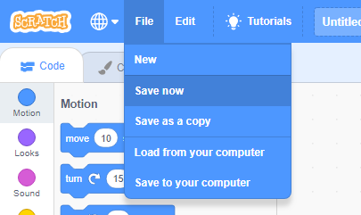

+ ඉහළින් ඇති පෙළ කොටුවට(text box එකට) නමක් ටයිප් කිරීමෙන් ඔබේ වැඩසටහනට නමක් ලබාදෙන්න.

+ ඔබට ** ගොනුව(File) **ක්ලික් කර ඉන්පසු ** දැන් සුරකින්න(Save now) ** ක්ලික් කර ඔබේ ව්‍යාපෘතිය සුරැකීමට පුළුවන.

** සටහන: ** ඔබ අන්තර්ජාලයට සබැඳිව නොමැති නම් හෝ Scratch ගිණුමක් නොමැති නම්, ඒ වෙනුවට** ඔබේ පරිගණකයට සුරකින්න(Save to your computer) ** ක්ලික් කිරීමෙන් ඔබේ ව්‍යාපෘතියේ පිටපතක් සුරැකිය හැක.