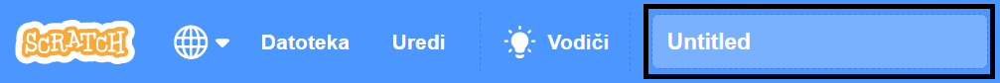
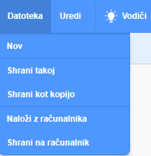

First, to give your program a name, type the name of your program in the project name box at the top of the screen:

**Note:** Če nisi povezan s spletom ali nimaš Scratch računa, lahko kopijo projekta shraniš s klikom na **Shrani na računalnik**.

**Note:** If you are not online or you do not have a Scratch account, you can click on **Save to your computer** to save a copy of your project.