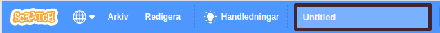
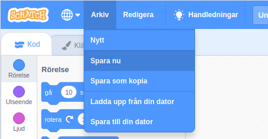

First, to give your program a name, type the name of your program in the project name box at the top of the screen:

**Obs!** om du inte är online eller inte har ett Scratch-konto kan du spara en kopia av ditt projekt genom att klicka på **Spara till din dator** istället.

**Note:** If you are not online or you do not have a Scratch account, you can click on **Save to your computer** to save a copy of your project.