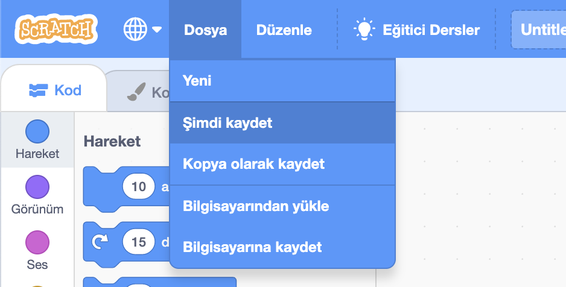

+ Üstteki metin kutusuna yazarak programınıza bir isim verin.

+ Projenizi kaydetmek için **Dosya** kısmından **Şimdi kaydet** seçeneğini tıklatabilirsiniz.

**Note:** if you are not online or don't have a Scratch account, you can save a copy of your project by clicking on **Save to your computer** instead.