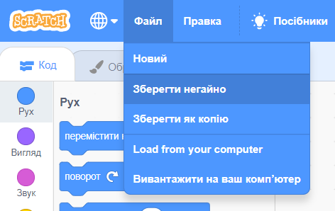

+ Дайте назву вашому проекту, набравши її в текстовому полі вгорі.

+ Щоб зберегти ваш проект, вам треба натиснути **Файл**, а потім **Зберегти негайно**.

**Примітка:** якщо ви не підключені до мережі або у вас немає облікового запису в Scratch, ви можете зберегти копію свого проекту, натиснувши **Вивантажити на ваш комп'ютер**.