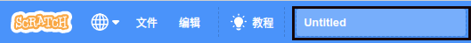
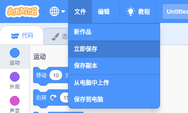

+ 在页面上方的文本框中输入你想给你的程序起的名字。

+ 接着你可以点击**文件**然后点击**保存项目**来保存你的项目。

**Note:** if you are not online or don't have a Scratch account, you can save a copy of your project by clicking on **Save to your computer** instead.