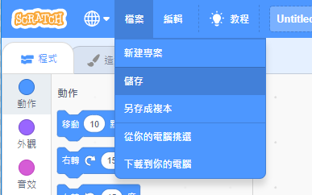

First, to give your program a name, type the name of your program in the project name box at the top of the screen:

你可以點擊**檔案**然後從選單中使用**儲存**功能。

**注意：**如果你使用離線編輯器，或是你在線上卻沒有 Scratch 帳戶，你可以把檔案**下載到你的電腦**。